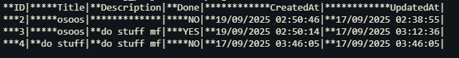

# Tasky

A CLI task manager with sqlite that perform crud operate with cli commands
<p float="left">
  
</p>

## Installation

cd to root dir of this project

## Usage

Get list of commands
``` -help ```

Add to taksy
```-add "title=example title;description=example description" ``` please follow this syntax to avoid parse error

Get All task from tasky
```-list ```

Mark task as done in tasky
```-done "id=3;done=yes" ``` or ```-done "id=3;done=no" ```

Update a task in tasky 
``` -update ""id=2;title=ososos ``` add any param you want description or title but id is required 

Delete task from tasky 
```-delete 1 ```